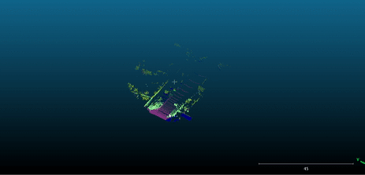

# Sexy Semantic Mapping
This is an implementation of a pipeline to combine the data from LiDAR and Camera to obtain semantic painted point cloud.
DeepLabV3+ network has been used on KITTI-360 dataset to do semantic segmentation for the RGB images and then using these RGB semantics and extrinsics between camera and LiDAR, each 3D point in the point cloud has been labelled.

## Dataset - KiTTI-360

Download the stereo camera images and Velodyne sensor data from any of the 9 sequences of the KITTI-360 dataset and store it in the `Code/Data` folder as specified. The dataset can be downloaded from [here](https://www.cvlibs.net/datasets/kitti-360/index.php).

## Usage Guidelines:

1. To do semantic segmentation of RGB images, get the pretrained model of DeepLabV3plus from [here](https://github.com/VainF/DeepLabV3Plus-Pytorch).

2. Go to the parent folder of this repo, that is, [LiDAR_3D_semantics](.) and enter the command:
```
python3 Wrapper.py --path **path_to_dataset_folder**
```

## Results:

#### 1. Segmented RGB image and point cloud projections on the image.


#### 2. Semantically Segmented Point Cloud



## References

1. [PointPainting: Sequential Fusion for 3D Object Detection](https://arxiv.org/abs/1911.10150)
2. https://rbe549.github.io/fall2022/hw/hw2/
3. https://github.com/naitri/PointPainting
4. https://github.com/VainF/DeepLabV3Plus-Pytorch